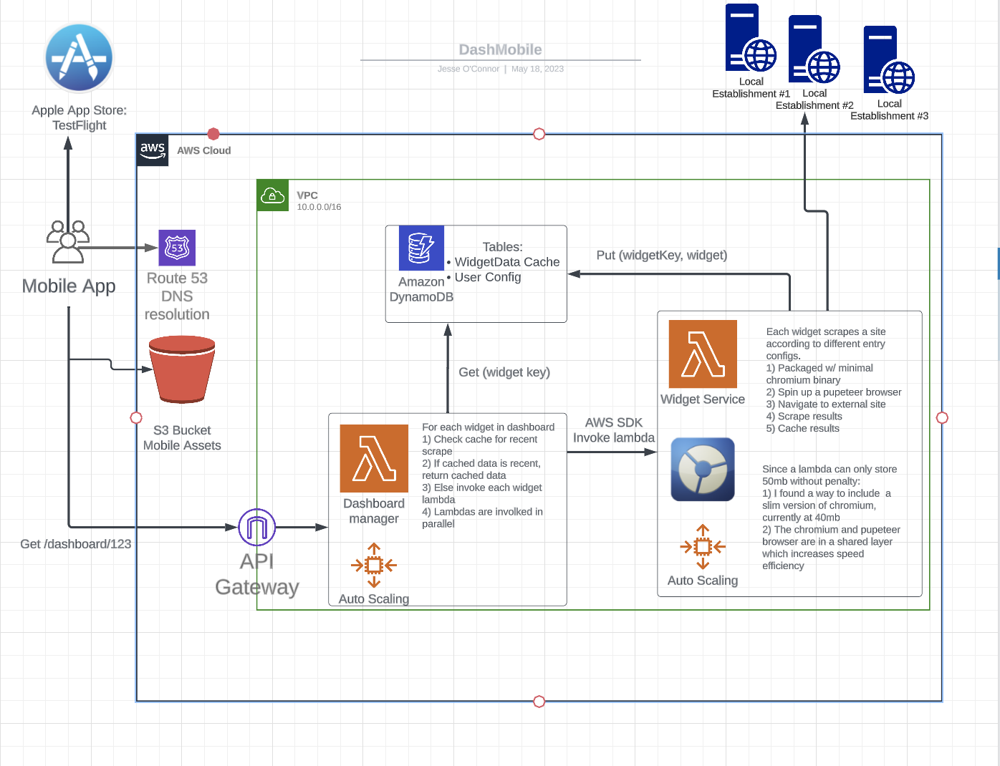

Rand Al'Thor (Wheel of Time)

# Server Side Slinger



This is a service that can be leveraged to easily scrape countless web pages and dislplay them in DashMobile.

I designed it to be satisfy my own itch around being too lazy to constantly monitor the local music venues in my area. 
This service allows me to keep up to date on my favorite local sites so I never miss a local show again!

It is extremely optimized for asynchronous execution, to the point where I saw 10x performance inprovements.

[Backend](https://github.com/jessekoconnor/server-side-slinger): AWS lambda functions, API gateway, Dynamo database
[Frontend](https://github.com/jessekoconnor/WebSurfer): App store, Reach native, Expo
    * [App store link](https://testflight.apple.com/join/br5KTP6i)

## Example usage of the service

### Simple example:

This scrapes a website that has a list of live events in my city.

```javascript
let core = new Widget({
    key = 'newKey',
    title = 'BlueNote Jazz Club',
    subtitle = 'NYC',
    config: {
        url: 'https://pressroomnh.com/live-music-portsmouth-nh-events/',
        query: {
            val: 'div.wpb_wrapper > div.wpb_row',
            query: [
                // Contains title
                'h2',
                // Date
                'h6',
            ],
        },
        postProcessing: event => {
            if(!event[0] || !event[1]) return;
            // Format service takes title, date
            return FormatService.formatEvent(event[0], event[1])
        },
    },
}).run();
```

`config`: This is the main config here. It uses recursion until its at the leaf element and then it grabs innerHTLM or attributes. 

`postProcessing`: This function is called for each scraped leaf node.

Its a service that allow the usage of jquery selectors to automate scraping in an extremely precise way.

Its true that websites change, so these configs break. Luckily it doesnt happen too often that a local business gets a website revamp, and also luckily its easy to fix a config!

### Complex Example

```javascript
new Widget(
    {
        key,
        title,
        subtitle,
        config: {
            url: 'https://www.themusichall.org/calendar/?exclude=&month={{year}}-{{month}}',
            pages: 2,
            nextPage: ({ month }) => ({ month: month + 1 }),
            query: {
                val: 'div.day--has-events',
                query: [
                    // month
                    'span.day__month',
                    // day
                    'span.day__number',
                    {
                        val: 'li.xdgp_genre-music',
                        query: [
                            // title
                            'p.event__title',
                            // time
                            'section.action__time'
                        ]
                    },
                ],
            },
            postProcessing: event => {
                const [ month, day, title, _time ] = event;
                if (!month || !day || !title || !_time) return;

                return FormatService.formatEvent(title, `${month} ${day} ${time}`);
            },
        },
    }
);
```

`url: 'https://www.themusichall.org/calendar/?exclude=&month={{year}}-{{month}}`: This indicates to the scraper to replace `month` and `year` w/ current mo/yr

`pages: 2,`: this indicates that the lambda can parse two pages to process in parallel (after the browser is started of course)

`nextPage: ({ month }) => ({ month: month + 1 })`: Tells the scraper how to generate the next page's url

Notice how in this example there are 3 levels to the config object, and this 3 levels of recursion. This pattern supports heavy recursion with minimal risk of a stack overflow due to how the variables are stored in memory versus as function args on the call stack. Check out the recursive function [here: getSelection](src/services/ScraperSSR.js#getSelection)

## File structure

File structure is described below:

```bash
.
├── README.md                   <-- This file
├── .travis.yml                 <-- Travis job: runs tests && deploys to lambda (master)
├── .package.json               <-- Contains all ci scripts
├── src                         <-- Source code for the Server Side Slinger function
│   ├── package.json            <-- Scoped to src package.json
│   └── tests                   <-- Unit tests && Integration tests
│   │   └── unit
│   │   └── integration
│   └── dashboards              <-- Dashboards are logical groupings of widgets
│   │   └── Lifestyle           <-- Yoga classes, live music, and more
│   └── widgets                 <-- Widgets are configs about how to scrape a web-page
│   │   └── Press room          <-- local portsmouth bar scraping config
│   │   └── 3 bridges yoga      <-- local portsmouth yoga studio scraping config
│   │   └── Blaze yoga          <-- local portsmouth yoga studio scraping config
│   └── services                <-- Services that handle complex logic
│   │   └── Caching service     <-- Caches widget results in DynamoDB
│   │   └── Date service        <-- Parses vague date strings
│   │   └── Format service      <-- Formats the data for delivery to the front end
│   │   └── Scraper SSR         <-- Loads up chromium and parses using [Puppeteer](https://github.com/GoogleChrome/puppeteer)
│   │   └── Widget service      <-- Returns a lambda ready widget
└── template.yaml               <-- SAM template
```

## Local dev
Prerequisites: Install aws cli and sam cli

To run locally, just clone the repo and run the following code:
```bash
npm run start-local
```
This utilizes AWS Sam local functionality to start up the local lambda functions using docker and a lambda image

## Deployment (CI/CD)
To deploy this code, create a PR to master. Upon successful test run in travis, I will merge the PR, and the code will get deployed from travis.


The deployment configuration is held in ```template.yml``` and is deplopyed with ```sam deploy``` 

## Testing
To write a PR that passes the tests, you will need to understand how to run the tests.
There are integration tests and unit tests.

Integration tests require that this service is running locally, and it proceeds to make network requests to the running lambdas locally, verifying their results.

Unit tests should be added for all new features. These must be passing for a PR to be approved. Poor quality code will be rejected.

## Adding a widget or a dashboard
After countless refactors, it is a piece of cake to add a widget or a dashboard. Use a working widget or dashboard as an model for new entities. 

## Images
Every widget needs an image and a favicon. Add images and favicons into ```./img```. Images are deployed from travis alongside the code. 

## Running locally with Dynamo (Under Development)
Got to run a local docker container for dynamo:
```cd src && npm run local-dynamo```
Also need to create the table too:
```
aws dynamodb create-table \
--endpoint-url http://localhost:8000 \
--table-name table3 \
--attribute-definitions AttributeName=id,AttributeType=S \
--key-schema AttributeName=id,KeyType=HASH \
--provisioned-throughput ReadCapacityUnits=5,WriteCapacityUnits=5
```

Scan a table using the following:
```
aws dynamodb scan --endpoint-url http://localhost:8000 --table-name table
```

List the tables:
```
aws dynamodb list-tables --endpoint-url http://localhost:8000
```
